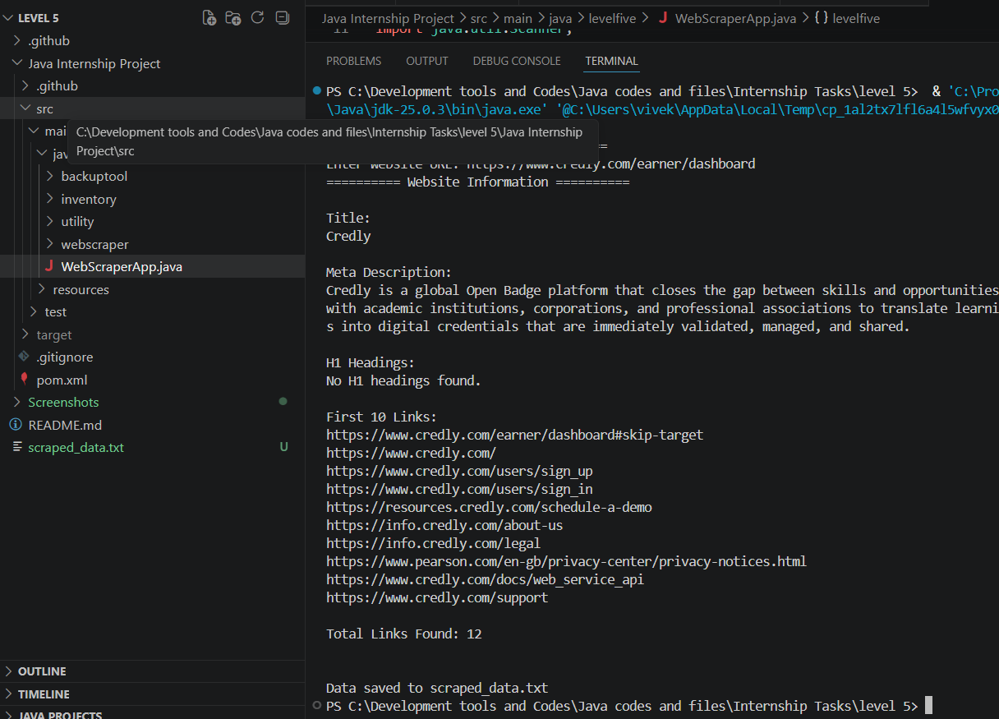
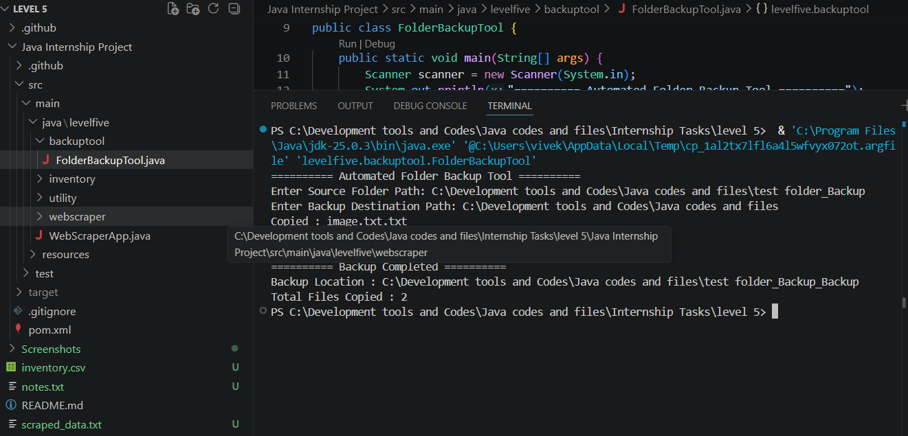
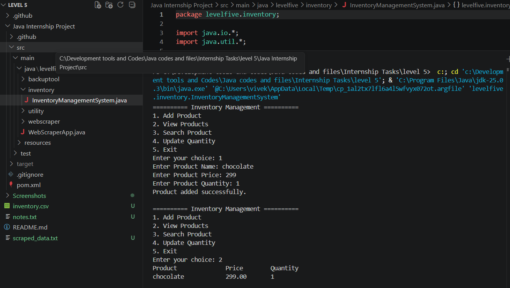
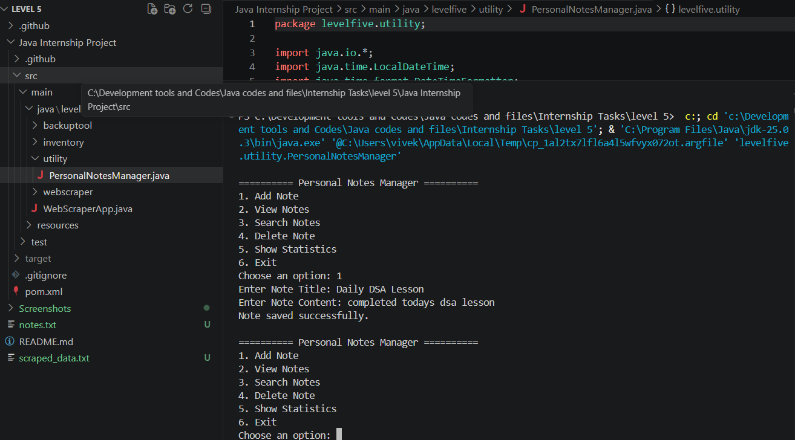

# ☕ Sysslan Java Internship Projects


> A collection of real-world Java applications developed during my **Java Developer Internship** at **Sysslan IT Solutions**.

This repository showcases practical Java projects focused on solving real-world problems using Core Java, Maven, JSoup, Java NIO, File Handling, Collections Framework, and Object-Oriented Programming.

---

## 📌 Repository Overview

During this internship, I worked on developing multiple console-based Java applications that emphasize clean coding practices, modular design, and practical software development concepts.

The projects demonstrate:

- Object-Oriented Programming (OOP)
- File Handling
- Java Collections Framework
- Java NIO
- Exception Handling
- CSV Data Processing
- Maven Project Management
- Web Scraping using JSoup

## 📂 Projects Included

| Project | Description | Key Technologies |
|----------|-------------|------------------|
| 🌐 Web Scraper | Extracts webpage title, headings, hyperlinks and metadata using JSoup. | Java, Maven, JSoup |
| 📁 Automated Folder Backup Tool | Creates recursive backups while preserving the original directory structure. | Java NIO, File Handling |
| 📦 CSV Inventory Management System | Manages product inventory using CSV files with search and update operations. | Java Collections, CSV Processing |
| 📝 Personal Notes Manager | Provides note creation, search and management using text file storage. | File Handling, OOP |


---

# 📸 Project Demonstration

## 🌐 Web Scraper



---

## 📁 Automated Folder Backup Tool



---

## 📦 CSV Inventory Management System



---

## 📝 Personal Notes Manager




---

## 🛠️ Technologies Used

- Java
- Maven
- JSoup
- Java NIO
- File Handling
- Java Collections Framework
- Exception Handling
- CSV Processing
- Object-Oriented Programming (OOP)

---

## 💡 Skills Demonstrated

- Writing modular and maintainable Java code
- Working with Maven dependencies
- Processing CSV and text files
- Web scraping using JSoup
- Directory traversal using Java NIO
- Console-based application development
- Input validation and exception handling
- Designing menu-driven applications


## 📁 Repository Structure

```text
Sysslan-Internship-Java-Projects
│
├── README.md
├── .github/
│   └── modernize/
│       └── java-upgrade/
│
└── Java Internship Project/
    ├── .gitignore
    ├── pom.xml
    ├── src/
    │   └── main/
    │       └── java/
    │           └── levelfive/
    │               ├── WebScraperApp.java
    │               ├── backuptool/
    │               │   └── FolderBackupTool.java
    │               ├── inventory/
    │               │   └── InventoryManagementSystem.java
    │               └── utility/
    │                   └── PersonalNotesManager.java
    ├── inventory.csv
    ├── notes.txt
    ├── scraped_data.txt
    └── application_log.txt
```

---

## 🏗️ Project Architecture

The project follows a modular package structure where each package represents an independent application developed during the internship.

| Package | Purpose |
|----------|---------|
| `webscraper` | Website scraping using JSoup |
| `backuptool` | Folder backup and directory management |
| `inventory` | CSV-based inventory management system |
| `utility` | Personal notes management system |


---

## ▶️ How to Run

### Prerequisites

- Java 17 or later
- Apache Maven
- Internet connection (required for the Web Scraper)

### Clone the Repository

```bash
git clone https://github.com/vivek9729/Sysslan-Internship-Java-Projects.git
```

### Build the Project

```bash
mvn clean compile
```

Run the desired application from your IDE (VS Code/IntelliJ) or using Maven.

---

## 📚 Learning Outcomes

This internship provided practical experience in:

- Building modular Java applications
- Managing projects using Maven
- Web scraping with JSoup
- Working with Java NIO for file operations
- Reading and writing CSV/Text files
- Exception handling and input validation
- Writing clean and maintainable code

---

## 🚀 Future Improvements

- Add a graphical user interface (JavaFX/Swing)
- Store data in a relational database
- Generate PDF and Excel reports
- Implement logging using Log4j
- Develop REST APIs using Spring Boot

---

## 👨‍💻 Author

**Vivek Dubey**

- GitHub: https://github.com/vivek9729
- LinkedIn: https://www.linkedin.com/in/vivek-dubey-08b82229b
